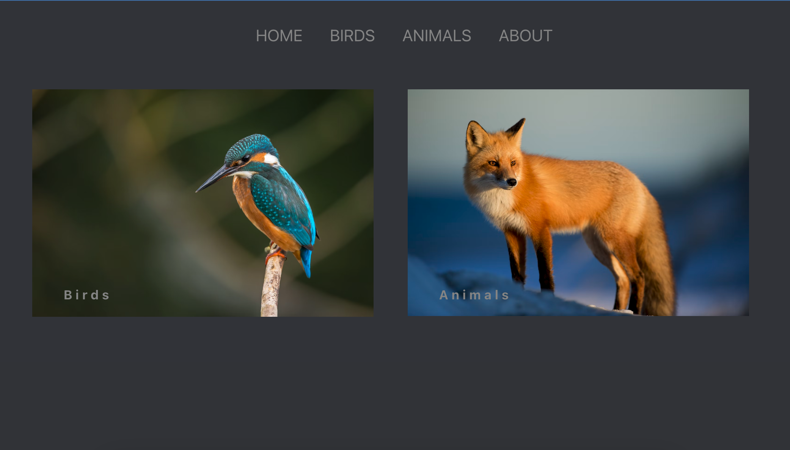
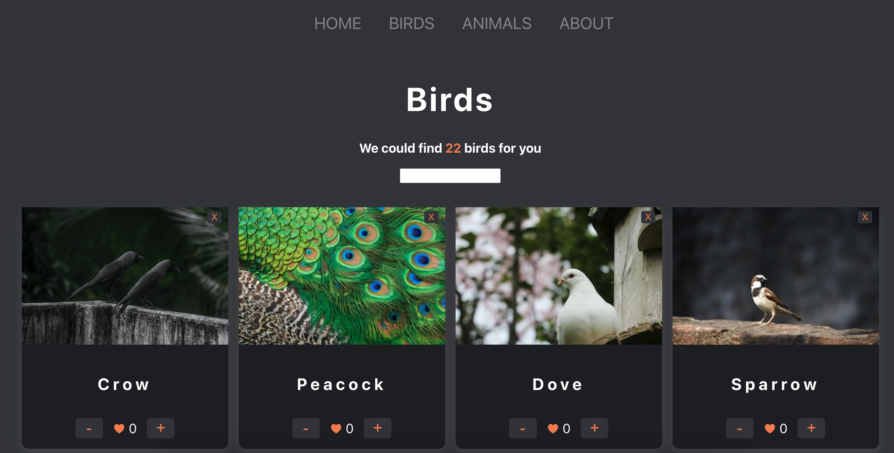
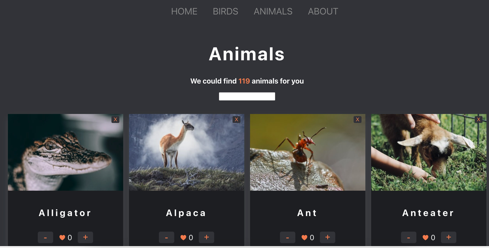

# TasteIT:

## Short description

Welcome to my Animals&Birds application. This application is created as a task assigned to me as a part of my studies in REACT22S programme.

Animals&Birds is a web application where users can get pictures of animals and birds by their name, add/remove likes to/of each animal/bird. Users also can remove the card of each animal/bird from the list. The pictures are fetched from internet by name, so there can be some surprising images not matching the name of the animal/bird.

## Technologies used

### Built with:

- REACT
- CSS
- JS
- HTML

## Setup and usage

Live page [here](https://codelamat.github.io/Animals-birds/)

## Screenshot

### Homepage

### Birds page

### Animals page

### Authors and acknowledgment

Eyvaz Alishov

- GitHub @CodeLaMat
- [LinkedIn](https://www.linkedin.com/in/eyvaz-alishov-54361054/)

## License

Copyright © 2022 [Eyvaz Alishov](https://github.com/CodeLaMat)

This project is [MIT](https://github.com/CodeLaMat/Animals-birds/blob/master/LICENSE) licensed

# Getting Started with Create React App

This project was bootstrapped with [Create React App](https://github.com/facebook/create-react-app).

## Available Scripts

In the project directory, you can run:

### `npm start`

Runs the app in the development mode.\
Open [http://localhost:3000](http://localhost:3000) to view it in your browser.

The page will reload when you make changes.\
You may also see any lint errors in the console.
